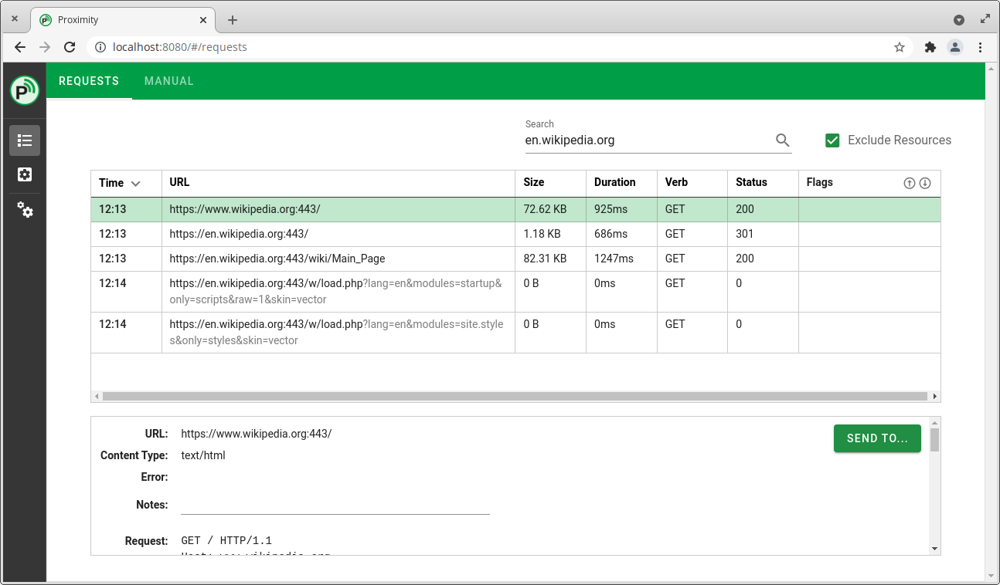

<picture>
  <source media="(prefers-color-scheme: dark)" srcset="docs/resources/Banner-Dark.svg">
  
</picture>

## Overview
Pakiki is an intercepting proxy, allowing you to view and manipulate network requests between your web browser and the servers its communicating with. It is designed for web application penetration testing, but could be used for general debugging of applications, etc. It is similar in principle to mitmproxy or OWASP ZAP.

It takes the philosophy of do one thing, and do it well. The intent is not to pack in features which are rarely, if ever, used in practice. This is especially true where good quality standalone tools already exist.

This repository contains the html frontend used to view the proxied traffic and perform other key functions.  The web interface is intended to be used for forward deployments, quick testing, or where the desktop interfaces won't otherwise run. It's not as polished as or as featureful as the dedicated desktop interface(s).



One of the reasons for developing this is to give back to the community. I want to help people who are new to pentesting, while still having 99% of what experienced pentesters need day to day.

Feedback would be greatly appreciated.

## Installation
Download from the latest release from [https://github.com/forensant/pakiki-core/releases](https://github.com/forensant/pakiki-core/releases)

## Development/build instructions

### Dependencies
You will need npm in order to build or run the frontend. You will also likely need [Pakiki Core](https://github.com/forensant/pakiki-core/releases) as well, either pre-compiled or built from scratch.

#### Project setup
```
npm install
```

#### Compiles and hot-reloads for development
```
npm run serve
```

#### Compiles and minifies for production
```
npm run build
```

#### Lints and fixes files
```
npm run lint
```

## 🤝 Contributing

Contributions, issues and feature requests are welcome.<br />
Feel free to check [issues page](https://github.com/forensant/pakiki-frontend-html/issues) if you want to contribute.<br />
[Check the contributing guide](https://github.com/forensant/pakiki-core/CONTRIBUTING.md).<br />

While this frontend will remain free and open source, there will be other commercial frontends built on top in the future with further features which are designed to help professional pentesters.

## Licence
This project is MIT licensed.
